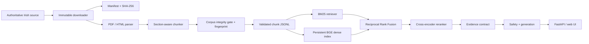

# System architecture

## Design boundaries

- Ingestion never silently overwrites raw material; blobs are addressed by checksum.
- Metadata is part of the chunk model and is returned with every retrieval result.
- Sparse and dense retrieval can be evaluated independently.
- Fusion consumes ranks, avoiding invalid comparison of unrelated score scales.
- The semantic index is bound to the corpus fingerprint and exact chunk order.
- Model-backed embeddings, rerankers, and generation providers are replaceable.
- Retrieval-only operation requires no external LLM and remains testable offline.
